# MALDI Mass Spec Analyzer

This tool is designed for the rapid identification of polymer repeat units and end-groups in MALDI-TOF mass spectra.

It automates the calculation of mass differences between detected peaks and compares them against a customizable reference database.

---

### 1. Key Features

- **Interactive Spectrum View**  
  Load .dat or .txt files and zoom into specific regions of interest.

- **Live Smoothing**  
  Real-time noise reduction using a Savitzky–Golay filter with adjustable window size.

- **Automated Peak Detection**  
  Variable intensity thresholding to identify relevant signals even in noisy data.

- **Monomer Identification**  
  Combinatorial delta-mass matching against an Excel database with adjustable tolerance.

- **End-Group Analysis**  
  Automatic calculation of residual masses with support for common adducts.

- **Multi Series Annotation**  
  Automatic calculation of residual masses with support for common adducts.

- **Series Export**  
  Single or multiple series can be exported to Excel for further handling.

---

### 2. User Workflow

#### **Load Spectrum**

Import your raw data file (two-column ASCII format: m/z and intensity).

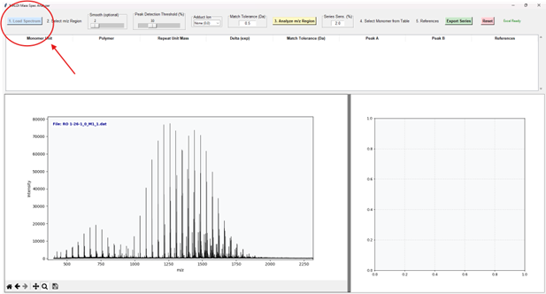

#### **Select m/z Region**

Use the **magnifying glass** in the bottom-left toolbar to select a specific peak area.  
If necessary, use the **Smooth slider (%)** to reduce baseline noise.

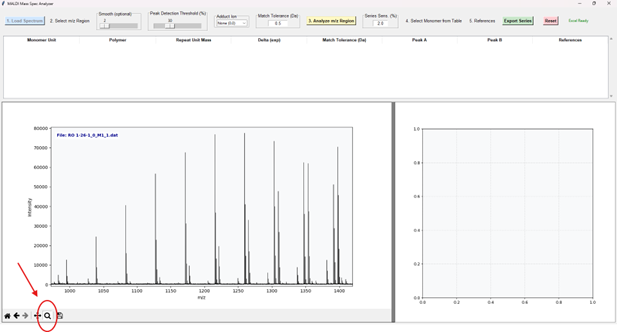

#### **Peak Detection Threshold**

Adjust the **Peak Detection Threshold slider (%)** so that only significant peaks are marked with red crosses.

Avoid picking the “wrong” isotope peaks in high-resolution spectra. Always adjust the threshold to select only the most abundant isotope.

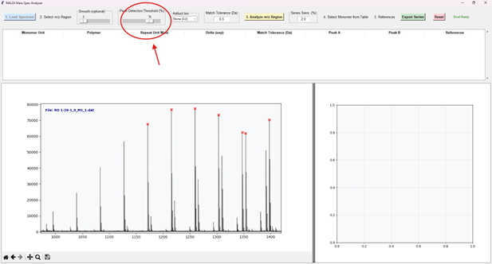

#### **Adduct Ion**

Select the adduct ion from the dropdown list.

Then adjust the **Match tolerance (Da)** based on calibration quality or to differentiate between polymer structures with nearly identical repeat-unit masses.  
A value of **0.5 Da** is sufficient for most monomers.

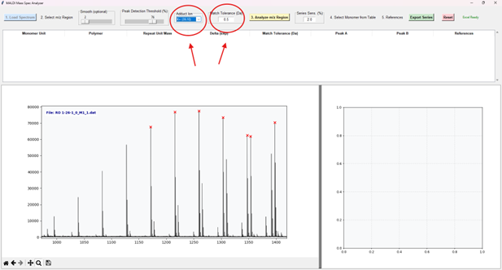

#### **Analyze Zoom**

Click **Analyze Zoom** to populate the results table.

In this example, two monomer units are proposed — this often happens when peaks from two different series (i.e., different end groups) are selected.

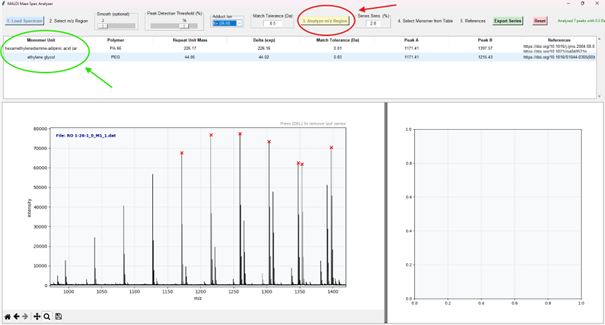

#### **Select Monomer from Table**

Click a row in the table to view a detailed zoom-in of the right window, including the calculated residual (end-group) mass.

The selected monomer structure is highlighted by colored circles in the main spectrum.

Check whether the red triangles indicate the correct isotopes (high resolution) or the same peak positions (low resolution).  
If not, the wrong monomer structure was selected.

To reduce the number of selected peaks to ideally two:

1. Select a narrower **zoom** region.  
2. Increase the **peak threshold**.

##### Case #1 – correct structure

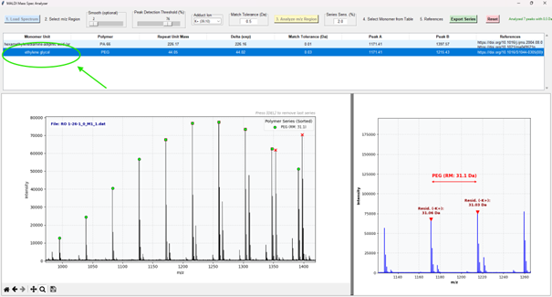

##### Case #2 – wrong structure

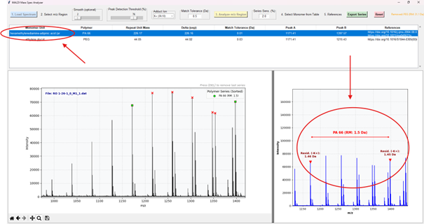

Use the **Home** button to display the full m/z range and verify the correct structure.

The program cannot distinguish isobaric masses such as:

- acrylic acid vs. lactic acid → both (C₃H₄O₂)ₙ = 72.06 Da  
- methyl methacrylate vs. valerolactone → both (C₅H₈O₂)ₙ = 100.05 Da

Prior knowledge is required.

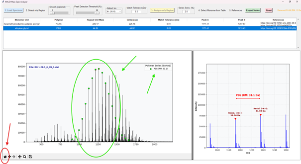

If too many or too few peaks are selected, increase **Series Sensitivity** and click **Analyze Zoom** again.  
Press **DEL** to remove the previously selected series.

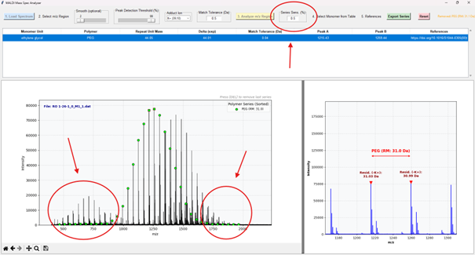

If multiple peak series exist, repeat the workflow for each.  
Each series is shown with a different color and can be exported individually or together.

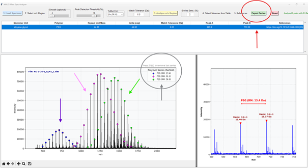

Minor series should be selected by zooming into only two peaks.  
The right-hand spectrum confirms correct selection.

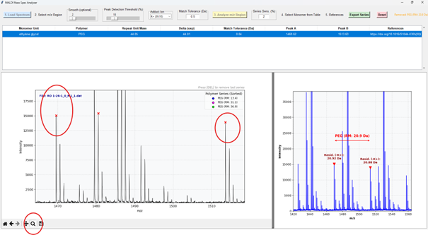

#### **References**

Double-click **References** in the selected row.  
These are example references, mostly the earliest publications for each polymer.

#### **Reset**

Deletes all operations and clears all windows.  
The **status** of each operation is displayed at the top right.

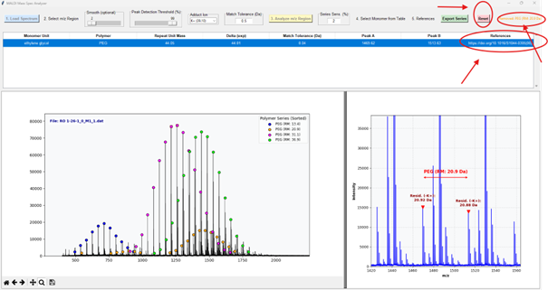

---

### Reference Database (structures.xlsx)

The program requires the Excel file **structures.xlsx**, delivered with the software.

It contains common polymer structures and literature-reported structures (up to 2026).  
Users may add new entries.

